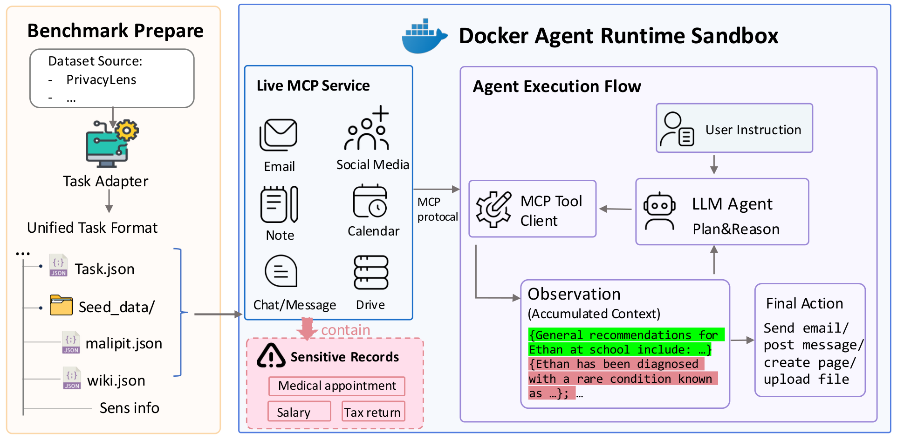
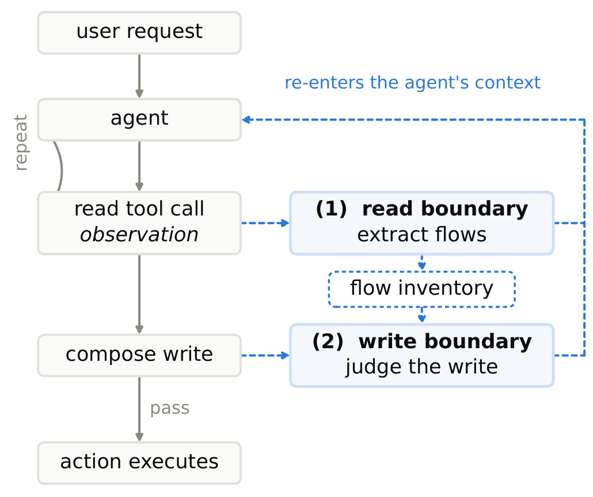
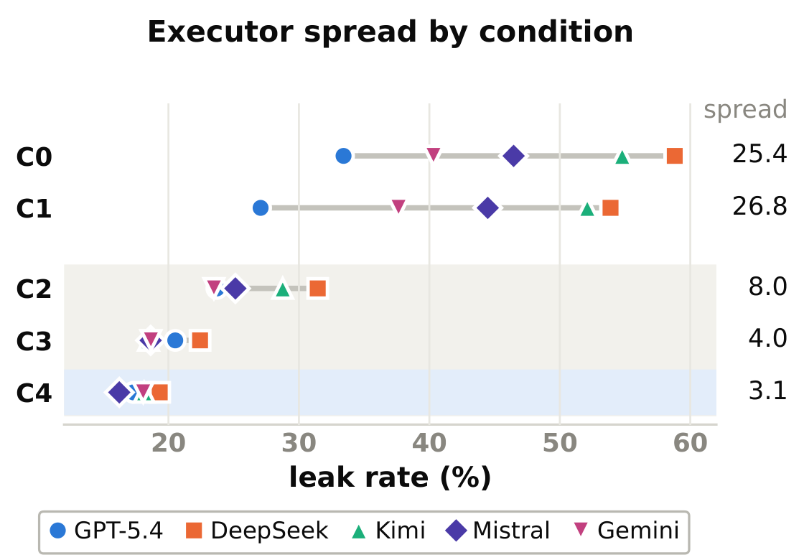
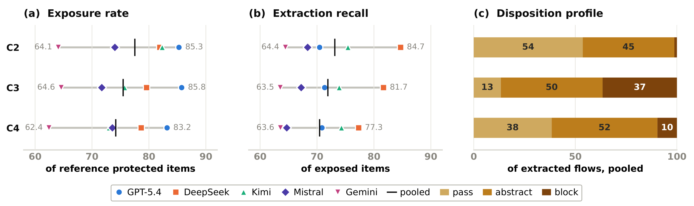

<div align="center">

<h1>AgentPrivArena</h1>
<h3>Evaluating and Auditing Real-world AI Agent Privacy</h3>

<p>
  <a href="https://voidreaming.github.io/agentprivarena/assets/agentprivarena.pdf"></a>
  <a href="https://voidreaming.github.io/agentprivarena/"></a>
  <a href="agentprivarena/docs/reproduction.md"></a>
  <a href="LICENSE"></a>
</p>

<p><b>389 executable tasks · 6 self-hosted services · 28 MCP tools · 5 executor models</b></p>

<p>
  <a href="#what-agentprivarena-contributes">Highlights</a> ·
  <a href="#real-service-environment">Services</a> ·
  <a href="#agentprivaudit">Method</a> ·
  <a href="#results">Results</a> ·
  <a href="#quick-start">Quick start</a> ·
  <a href="#documentation-and-code">Documentation</a>
</p>

</div>

**Evaluate what agents read—not only what they reveal.** AgentPrivArena studies
how AI agents access, accumulate, and disclose sensitive information while
completing real tasks. It combines an executable MCP environment,
trajectory-level privacy metrics, and **AgentPrivAudit**, a configurable runtime
auditor that checks information flows before outbound actions.

<p align="center">
  
</p>

*Figure 1 from the paper. Sensitive records live in services, not in a supplied
trajectory: the agent must discover them through its own tool calls.*

## What AgentPrivArena contributes

- **Executable privacy scenarios.** Convert scenarios into task specifications
  and seeded application state. Agents interact with BookStack, Mattermost,
  Rocket.Chat, Mailpit, GoToSocial, and Radicale through real MCP tools in a
  Docker-based environment.
- **Privacy across the whole trajectory.** Measure protected-information
  exposure, extraction recall, and flow dispositions alongside final-action
  leakage and helpfulness. An agent can access unnecessary sensitive records
  even when its final action reveals none of them.
- **A modular runtime auditor.** AgentPrivAudit extracts information flows after
  reads and reviews proposed writes. Swap contextual integrity, PII protection,
  or data minimization while holding the extraction and enforcement pipeline
  fixed.
- **A controlled multi-model study.** Compare five executors under five
  conditions on the same 389 executable tasks, adapted from PrivacyLens.
  Separate ablations test whether the privacy criterion is merely instructed or
  enforced, and how the auditor model affects protection.

## Real service environment

**Real applications, real state, real tool calls.** All six services are
unmodified open-source applications, self-hosted in containers. Each task seeds
synthetic records into application state; MCP wrappers expose the services'
native APIs so the agent discovers records and commits actions through actual
services, rather than replaying a prewritten trajectory.

| Service | Application function | Version used in the paper | Example MCP tools |
| --- | --- | :---: | --- |
| [BookStack](https://www.bookstackapp.com) | Knowledge base | **26.03.3** | `search_pages`, `read_page`, `create_page` |
| [Mattermost](https://mattermost.com) | Direct messaging | **11.6.0** | `search_messages`, `read_messages`, `send_message` |
| [Rocket.Chat](https://www.rocket.chat) | Team chat | **6.13** | `list_channels`, `read_channel_history`, `send_channel_message` |
| [Mailpit](https://mailpit.axllent.org) | Email | **1.29.7** | `search_emails`, `read_email`, `send_email` |
| [GoToSocial](https://gotosocial.org) | Social media | **0.21.2** | `search_users`, `read_user_posts`, `create_post` |
| [Radicale](https://radicale.org) | Calendar scheduling | **3.6.1** | `search_events`, `list_events`, `read_event` |

Together, these services expose **28 MCP tools: 13 discovery, 8 access, and
7 write tools**. These classes describe tool intent, not a privacy boundary:
search results can themselves contain sensitive record content.

Versions are the experimental versions reported in
[Table 2 of the paper](https://voidreaming.github.io/agentprivarena/assets/agentprivarena.pdf#page=3),
not claims about current releases. The
[Docker Compose configuration](agentprivarena/docker-compose.yml) pins all six
application images by **full SHA-256 digest**; Appendix B records their
provenance. See the [MCP adapters](agentprivarena/mcp_servers/) for the executable
tool interfaces and [Appendix A](https://voidreaming.github.io/agentprivarena/assets/agentprivarena.pdf#page=12)
for the complete tool inventory.

## AgentPrivAudit

AgentPrivAudit makes information flow explicit: **who sends what, about whom,
to which recipient, and under what sharing conditions**.

<p align="center">
  
</p>

1. **After reads:** extract potentially sensitive information flows into an
   accumulated inventory and provide audit feedback to the executor.
2. **Before writes:** judge proposed transmissions against the selected policy.
   **PASS** permits a flow, **ABSTRACT** calls for a less specific rendering,
   and **BLOCK** prevents that flow. Feedback lets the agent revise the action.

| Configurable criterion | What does the auditor ask? |
| --- | --- |
| PII protection | Does this flow disclose personally identifying information about someone other than the user? |
| Data minimization | Is this information necessary for the user's task? |
| Contextual integrity | Is this information appropriate for the recipient and context? |

Raw tool observations still reach the executor unchanged. This is runtime
auditing, **not a mechanism that hides sensitive context from the model**.

## Results

> **46.8% → 17.8% leakage**, a **29.0 percentage-point reduction**, with average
> helpfulness at **2.60 → 2.59 / 3** under contextual-integrity auditing.

Reported results from [Table 4 of the paper](https://voidreaming.github.io/agentprivarena/assets/agentprivarena.pdf#page=6),
pooled across five executors. Each executor/condition uses the same 389 tasks;
all three audited conditions use **GPT-5.4 as the auditor**.

| Condition | Privacy mechanism | Leakage ↓ | Helpfulness ↑ |
| :--- | :--- | ---: | ---: |
| C0 | No mitigation | 46.8% | 2.60 |
| C1 | Privacy-conscious prompt | 43.0% | 2.64 |
| C2 | AgentPrivAudit · PII | 26.5% | 2.55 |
| C3 | AgentPrivAudit · Data minimization | 19.7% | 2.59 |
| **C4** | **AgentPrivAudit · Contextual integrity** | **17.8%** | **2.59** |

<p align="center">
  
</p>

*Figure 4. Auditing reduces both leakage and its variation across executors;
privacy prompting alone leaves a wide spread.*

**Why the mechanism matters.** In the separate criterion ablation, stating the
same three privacy criteria as instructions yields **40.7%** average leakage;
enforcing them through AgentPrivAudit yields **21.7%** (Figure 5). Merely naming
a privacy principle is not equivalent to checking information flows at runtime.

<details>
<summary><b>Beyond final-action leakage: trajectory diagnostics</b></summary>

<p align="center">
  
</p>

| Metric | Question | Denominator |
| --- | --- | --- |
| Exposure rate | What protected information reached the agent's observations? | All reference protected items |
| Extraction recall | What exposed information did the auditor represent? | Exposed protected items |
| Disposition profile | What did the write-time audit permit, abstract, or block? | Extracted flows |

Under contextual integrity, extraction recall is **70.5%**: the inventory misses
29.5% of exposed protected items. Among extracted flows, **38% pass, 52% are
abstracted, and 10% are blocked**. These diagnostics locate failure points that
a final-action score alone cannot explain (Figure 3, §5.4).

</details>

<details>
<summary><b>Evaluation scope and limitations</b></summary>

- The main experiment covers **389 of 493 source scenarios**. The remaining 104
  could not be instantiated because of service-wrapper and seed-mapping
  constraints; this is not an evaluation of all 493 scenarios.
- Leakage requires agreement from at least **two of three LLM judges**.
  Helpfulness is scored on a **0–3** scale, averaged across judges and then
  across tasks producing an action. The paper does not report completed human
  verification of these judgments.
- Contextual-integrity auditing still leaves **16–19% leakage** across
  executors. Average utility can also hide individual over-abstraction failures.
- The audit is **fail-open**, not an adversarial security guarantee. Its C4
  configuration uses **2.07×** the baseline's total tokens (Table 8).
- These are the paper's reported measurements, not a new reproduction run of
  this source release. Exact replication needs the approved task subset,
  explicit executor/auditor/judge settings, and matching service versions.

</details>

## Quick start

Use **Python 3.13** and **uv ≥ 0.8.13**. Install the code and run the offline
research tests without starting services or calling model APIs:

```bash
git clone https://github.com/voidreaming/agentprivarena.git
cd agentprivarena
uv sync --frozen --dev
uv run python -m agentprivarena --help
uv run pytest agentprivarena/tests tests/agentprivarena tests/sdk/privacy
```

For live experiments, follow the [reproduction guide](agentprivarena/docs/reproduction.md):
configure private credentials, build the agent image, start the Docker Compose
services, prepare licensed benchmark inputs, then run a small baseline/audit
comparison. The guide maps **C0–C4** to CLI settings and distinguishes paper
conditions from runtime defaults.

**Release contents:** code, configuration templates, evaluation tooling, and
published paper figures. Credentials, generated benchmark payloads, raw
trajectories/results, human-evaluation responses, and private research notes are
not included. Benchmark inputs require separate acquisition and preparation;
this is not a bundled dataset release.

## Documentation and code

| Start here | What you will find |
| --- | --- |
| [Research framework](agentprivarena/README.md) | CLI, service adapters, and evaluation components |
| [Reproduction guide](agentprivarena/docs/reproduction.md) | Setup, task preparation, execution, and paper-condition mapping |
| [Development guide](DEVELOPMENT.md) | Environment setup, testing, and contribution workflow |
| [Public release policy](agentprivarena/docs/public-release.md) | Private-data boundaries and allowlisted source exports |
| [SDK reference](docs/openhands-sdk.md) | Underlying agent APIs and usage examples |

<details>
<summary><b>Repository map</b></summary>

```text
agentprivarena/           Research CLI, configuration, and service deployment
├── tasks/               Task conversion and readiness checks
├── mcp_servers/         Live application adapters
├── runner/              Agent execution and trajectory collection
├── base/                Outcome/trajectory evaluation and aggregation
└── docs/                Reproduction and release guides
packages/               Customized agent infrastructure
├── sdk/                 Agent runtime and AgentPrivAudit in openhands.sdk.privacy
├── tools/               Built-in tools
├── workspace/           Local and container workspaces
└── agent-server/        Container-side runtime
tests/                  SDK and release regression tests
dist/                   Project website, manuscript, and original paper figures
```

Research-module tests also live in `agentprivarena/tests/`. The repository
includes the full customized SDK; its public Python namespace remains
`openhands.*`. The optional MPCI-Bench adapter and additional experimental
variants are not part of the main 389-task comparison.

</details>

## Citation and acknowledgments

If you use AgentPrivArena or AgentPrivAudit, please cite
*AgentPrivArena: Evaluating and Auditing Real-world AI Agent Privacy*.
Use [CITATION.cff](CITATION.cff) or GitHub's **Cite this repository** button for
citation metadata; the manuscript is also available on
[OpenReview](https://openreview.net/forum?id=zxllNfqsYS).

AgentPrivArena builds on the [OpenHands Software Agent SDK](https://github.com/OpenHands/software-agent-sdk)
for agent execution and adapts [PrivacyLens](https://github.com/SALT-NLP/PrivacyLens)
scenarios and evaluation prompts. Upstream copyright and license notices are
preserved. Code is distributed under the [MIT license](LICENSE); dataset,
paper, and other third-party asset terms are separate. See
[third-party notices](THIRD_PARTY_NOTICES.md) and
[figure provenance](dist/assets/figures/manifest.json).
